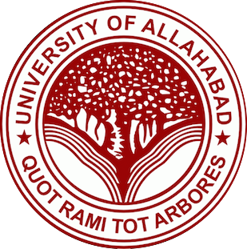

# JKOSC - JK Open Source Community 
A community of developers run by the students of JK Institute of Applied Physics and Technology. 

# Community Statement
We are a community of, and in solidarity with, people from every gender identity and expression, sexual orientation, race, ethnicity, language, neuro-type, size, ability, class, religion, culture, subculture, political opinion, age, skill level, occupation, and background. We acknowledge that not everyone has the time, financial means, or capacity to actively participate, but we recognize and encourage the involvement of all kinds. We facilitate and foster access and empowerment. We are all learners.
In practice:
- We are not coding snobs. We do not assume knowledge or imply there are things that somebody should know.
- We insist on actively engaging with requests for feedback regardless of their complexity.
- We welcome newcomers and prioritize the education of others. We strive to approach all tasks with the enthusiasm of a newcomer. Because we believe that newcomers are just as valuable in this effort as experts.
- We consistently make the effort to actively recognize and validate multiple types of contributions.
- We are always willing to offer help or guidance.

[Meet Our People!](people.md)

## Major Open Source Programs

| Program                                                                                                | Description                         |
|--------------------------------------------------------------------------------------------------------|-------------------------------------|
|[Linux Foundation Mentorship Program](https://mentorship.lfx.linuxfoundation.org/)                      |                                     |
|[Google Summer of Code](https://summerofcode.withgoogle.com/how-it-works/#timeline)                     |                                     |
|[Outreachy](https://www.outreachy.org/docs/applicant/)                                                  |                                     |
|[MLH Fellowship](https://fellowship.mlh.io/)                                                            |                                     |
|[Season of Docs](https://developers.google.com/season-of-docs)                                          |                                     |
|[Hacktober Fest](https://hacktoberfest.digitalocean.com/)                                               |                                     |
|[FOSSASIA Codeheat](https://codeheat.org/)                                                              |                                     |
|[RSoC](https://www.redox-os.org/rsoc/)                                                                  |                                     |
|[Season of KDE](https://season.kde.org/)                                                                |                                     |

## Organizations you may like!

### [RISC-V](https://github.com/riscv)

### [Circuit Verse](https://github.com/CircuitVerse)

### [Processing Foundation](https://github.com/processing)

### [Mozilla](https://github.com/mozilla)

### [Django](https://github.com/django)

## Resources
- https://guides.github.com/features/mastering-markdown/
- https://guides.github.com/introduction/git-handbook/
